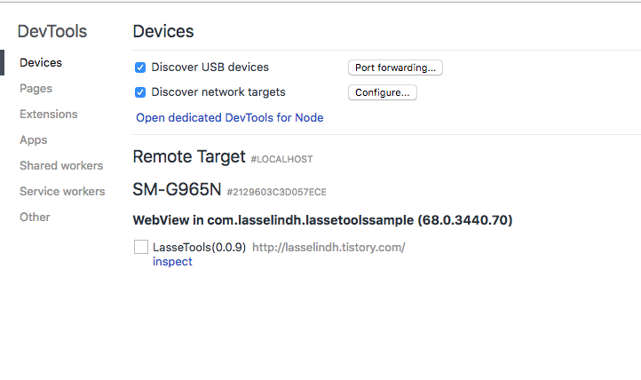
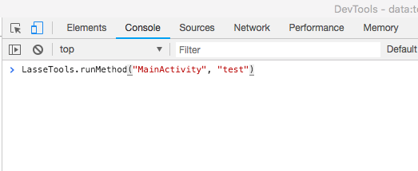
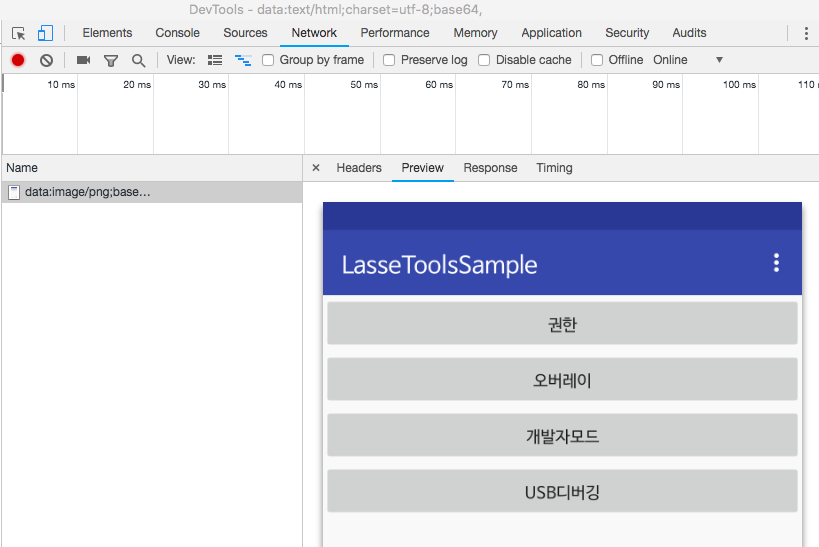
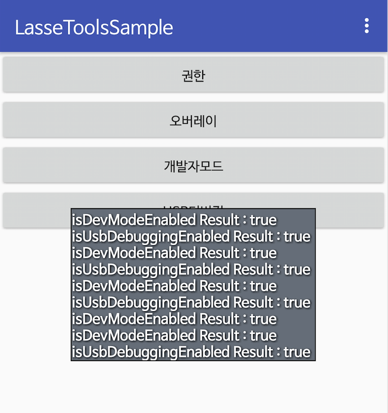

LasseTools는 앱개발에 도움?을 주는 여러가지 유틸기능과 디버깅을 지원하는 라이브러리 입니다.

웹뷰 크롬디버깅 및 자바리플렉션을 활용하여 스크립트를 이용하여 여러가지 디버깅 기능을 수행하고 

스크립트를 통해 자바 메서드에 접근가능한 기능을 제공합니다.


[  ](https://bintray.com/hanjuwan/maven/tools/_latestVersion)

적용방법 
``` 
dependenciesdepend  {
    implementation 'com.lasselindh:tools:x.y.z'
}
```

LasseTools


- 크롬디버깅 연결을 통한 기능(캡쳐, 로그수집, 메서드접근(액티비티/프래그먼트))


  // 공통 초기화 설정
```
LasseTools.getInstance().init(this, BuildConfig.DEBUG);
``` 
  메서드 접근을 사용하고자 할 시 Activity or Fragment에서 컨텍스트를 할당
  1) 접근하고자 하는 화면을 추가
```
LasseTools.getInstance().setScreen(this);
```
  2) 앱실행 및 크롬 Inspect를 실행하여 LasseTools를 클릭
  
  
  3) 스크립트 콘솔에서 
```
LasseTools.runMethod("액티비티클래스명", "메서드명");
LasseTools.runMethod("액티비티클래스명", "메서드명", "파라메터", "파라메터변수타입(int/String/boolean)")
```
  
  
  
  웹에서 로그캣을 보기 / 저장
  1) 앱실행 및 크롬 Inspect를 실행하여 LasseTools를 클릭
  
  2) 웹콘솔에서 아래 명령어 수행
  
  3) 아래권한이 필요하므로 메니페스트에 등록해주어야 한다.
  
  Manifest.permission.READ_EXTERNAL_STORAGE,
  Manifest.permission.WRITE_EXTERNAL_STORAGE
```
// 웹에서 로그캣을 보여준다. 
LasseTools.showLogcat();
// 로그캣의 로그를 핸드폰에 저장 
LasseTools.saveLogcat();
```
  
  웹에서 앱화면을 캡쳐하여 브라우저에서 보기 
  1) 앱실행 및 크롬 Inspect를 실행하여 LasseTools를 클릭
  
  2) 웹콘솔에서 아래 명령어 수행
  
  3) 아래권한이 필요하므로 메니페스트에 등록해주어야 한다.
  
  Manifest.permission.READ_EXTERNAL_STORAGE,
  Manifest.permission.WRITE_EXTERNAL_STORAGE
```
LasseTools.showScreen();
LasseTools.saveScreen();
```

  
  

  
  

  
  - 개발전용 토스트

  로그보다 토스트를 즐겨서 사용하는 분이 많습니다. 하지만 대부분의 폰에서는
  
  토스트를 여러번찍으면 스택에 쌓여서 밀리는 현상 및 씹히는 현상을 많이 볼수 있습니다.
  
  DToast를 사용하면 2초이내에 오는 토스트를 취합하여 차례대로 보여줍니다. 
  
  ex) 1, 2, 3 으로 메시지를 연속적으로 찍을 시 아래와 같이 같이 표기됩니다.
  
  
  
```
LasseTools.DToast(Activity activity, String string);
```
- 개발자모드 가져오기
```
LasseTools.getInstance().isDevModeEnabled()
```
- USB디버깅 옵션 가져오기
```
LasseTools.getInstance().isUsbDebuggingEnabled()
```


LassePermission
- 런타임 퍼미션 받기


```
String[] permissions = {Manifest.permission.WRITE_EXTERNAL_STORAGE, Manifest.permission.READ_EXTERNAL_STORAGE};
LassePermission.getPermission(this, permissions, new LassePermission.PermissionListener() {
    @Override
    public void onRequestResult(boolean allGranted, ArrayList<String> deniedPermissions) {
        Toast.makeText(MainActivity.this, "getPermission Result : " + allGranted, Toast.LENGTH_SHORT).show();  
    }
});
```
  
- 오버레이 퍼미션받기

아래 퍼미션을 메니페스트에 등록해야 폰설정에서 활성화 할 수 있습니다. 

<uses-permission android:name="android.permission.SYSTEM_ALERT_WINDOW" />


```
LassePermission.getOverlay(this, new LassePermission.OverlayListener() {
    @Override
    public void onCheckCompleted(boolean result) {
        Toast.makeText(MainActivity.this, "getOverlay Result : " + result, Toast.LENGTH_SHORT).show();
    }
});
```
  
[추가예정기능]
- 사용자통계권한 받기
- 개발전용 로그
- 지정구간에 대한 네트워크 사용량 측정
